# Observation

_After the close of the first day, Level 1 is drawn at the low point of the daily bar, and Level 0 is drawn at the highest point of the daily bar. Then, linear and logarithmic Fibonacci levels are observed._

Many newly listed altcoins on the Binance spot market, particularly those listed recently, adhere with high sensitivity to the Fibonacci usage method outlined above. Even after 2-3 months since their listing, Fibonacci levels drawn using this method continue to serve as potential support and resistance levels. Please observe the following examples carefully. Linear levels are shown in solid lines, and logarithmic levels are shown in dashed lines.

- 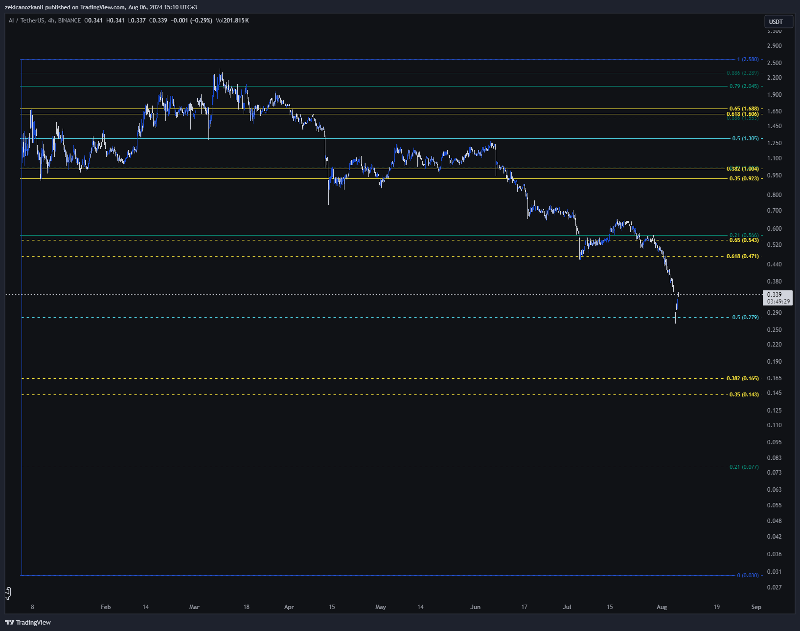
- 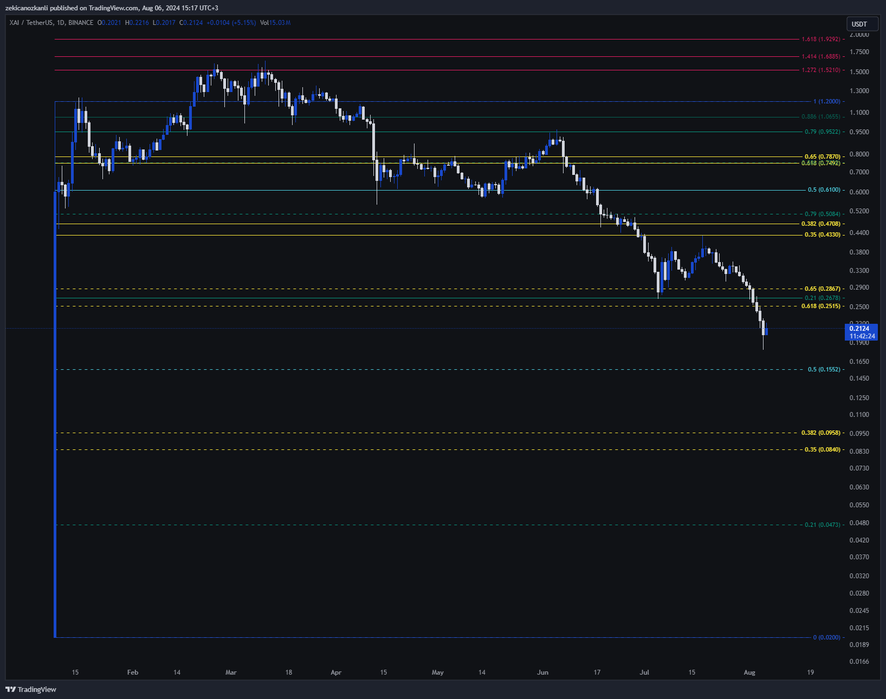
- 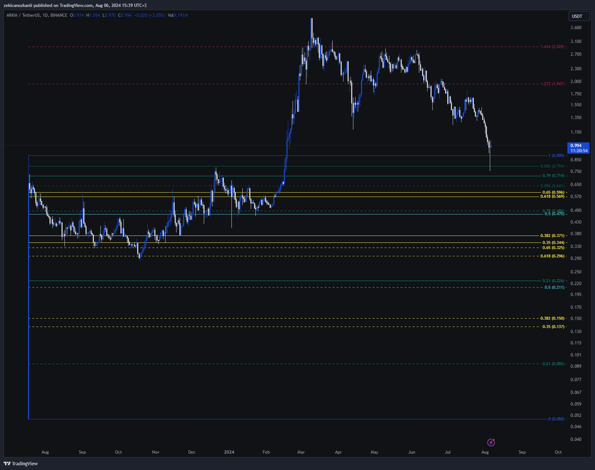
- 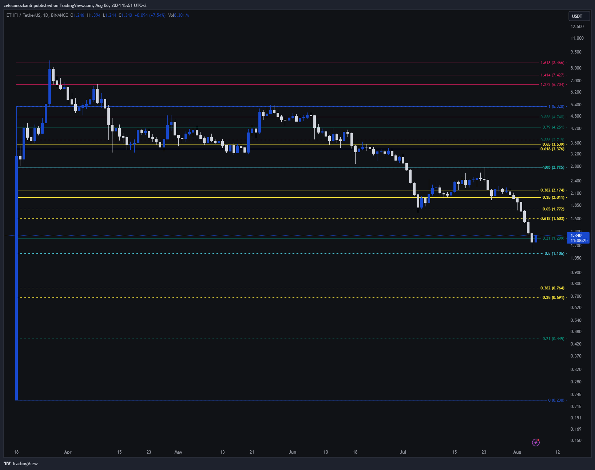
- 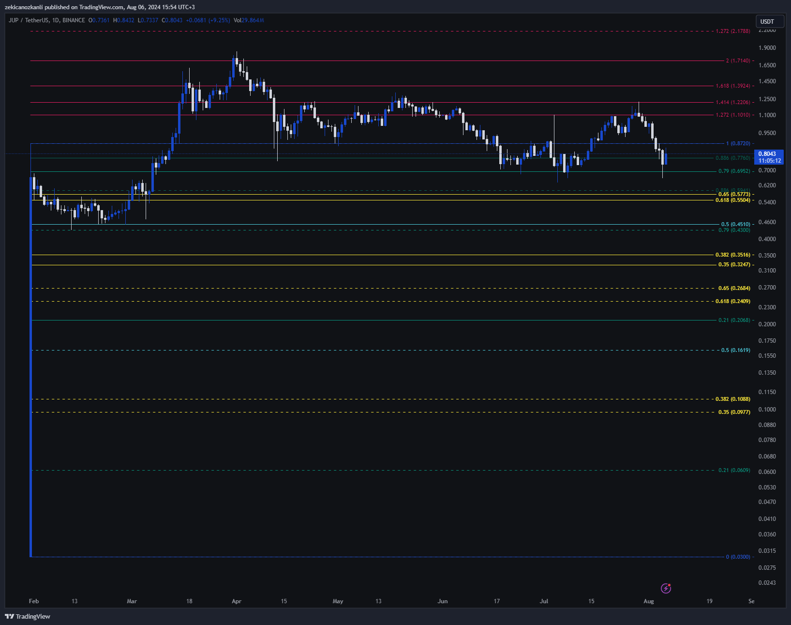
- 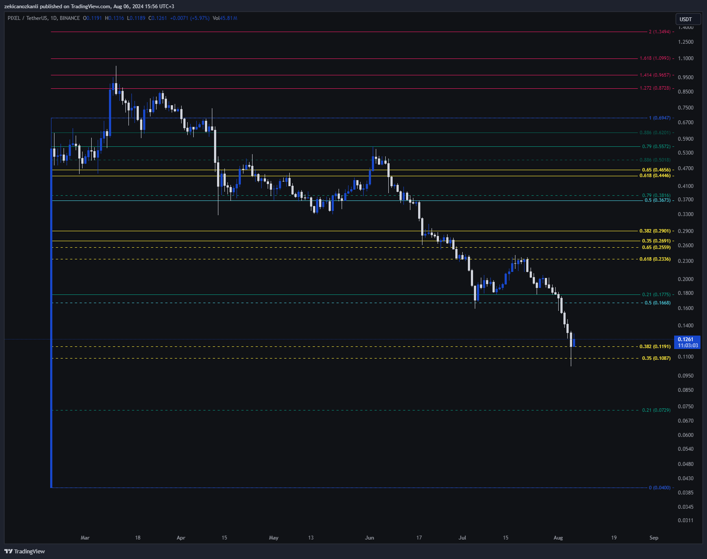
- 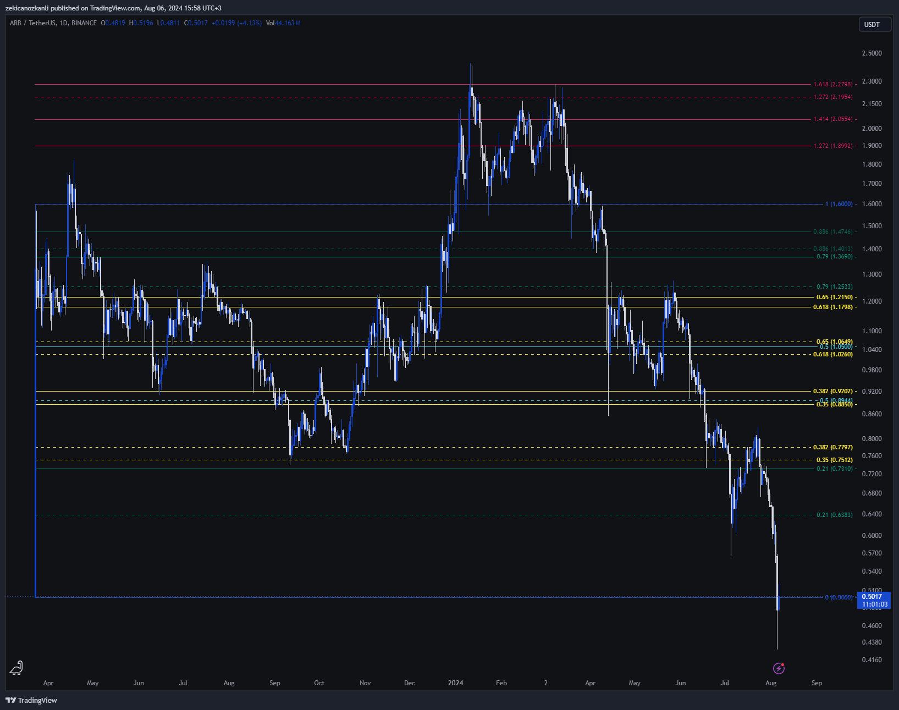
- 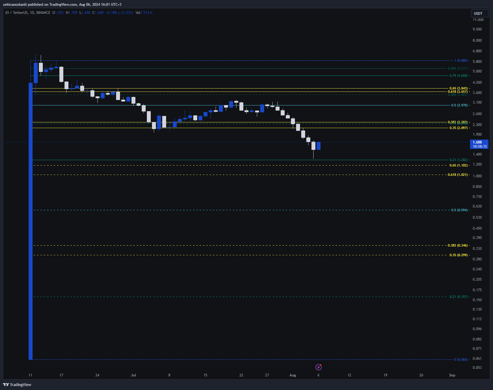
- 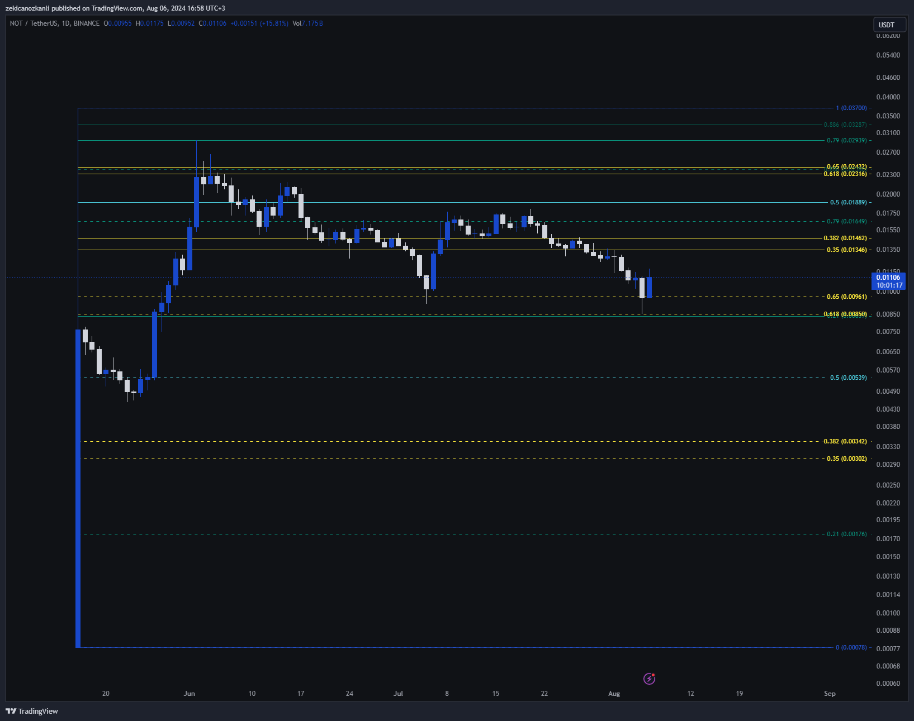
- 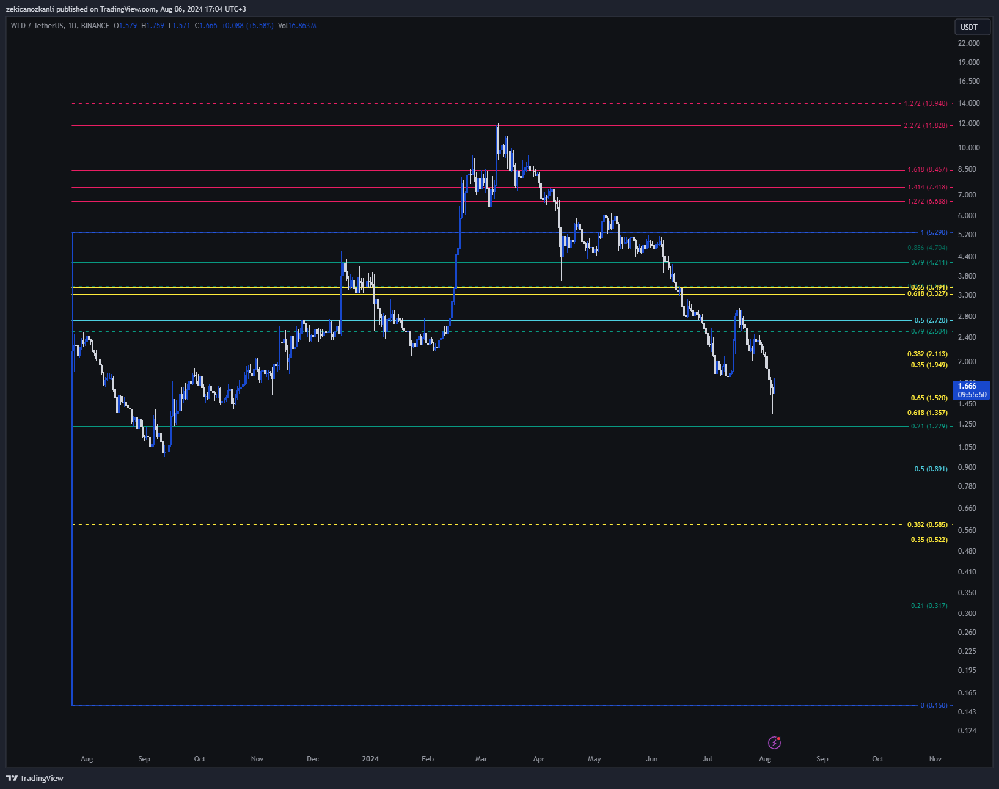
- 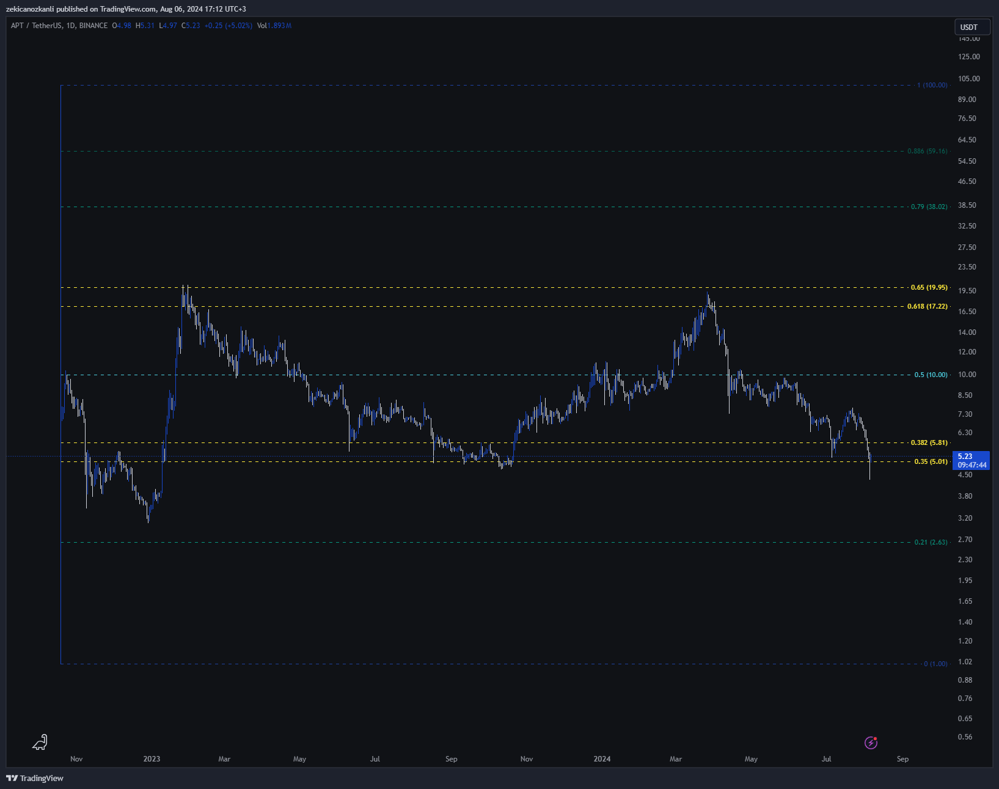